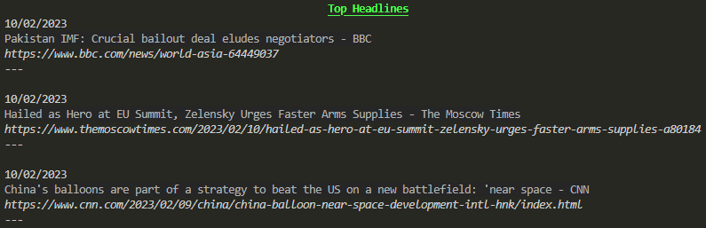

# News API Backend

The purpose of this project is to handle the backend fetching operations from newsapi.org in a pure rust manner which is ready to be consumed by a rust frontend project.

### Features

- Serde for JSON parsing
- Log printing for the top headlines, date and URL
- Async HTTP requests with [tokio](https://docs.rs/tokio/1.25.0/tokio/index.html)
- Error handling with [thiserror](https://docs.rs/thiserror/latest/thiserror)

### How to Use

- Gert your own [free API key](https://newsapi.org/docs/authentication) by logging in and generating one from newsapi.org.
- Swap out the "API_KEY" placeholder in the `.env` file for your generated key.
- `cargo run` to build and run.
